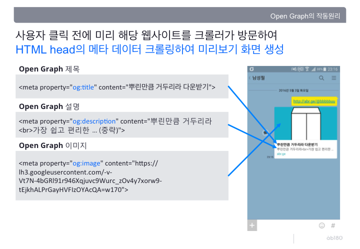

# HTML

> Hyper Text Markup Language

## Header

### \<meta\>

메타데이터는 데이터를 설명하는 데이터이다. HTML에 메타데이터를 적용하는 방법은 `<meta>`요소를 사용하는 것이다. 

#### og태그

페이스북의 오픈그래프 프로토콜을 사용해 브라우저나 검색 로봇에게 해당 페이지의 정보를 알려주는 기능.



**예시**

```html
<meta property="og:title"         content="사이트 제목" />
<meta property="og:description"   content="사이트 설명" />
<meta property="og:image" content="~~~~~.png" />
```

head에 위와 같은 meta데이터를 넣어 줌으로써 페이지의 정보를 넘겨줄 수 있다.

### Tip

- **EMMET** : 반복되는 HTML문법을 간단하게 만들어준다.(VS Code에 포함되어있음)
  - lorem : 예문만들기
  - 참고 : https://www.youtube.com/watch?v=m7wsrVQsVjI&list=PLv2d7VI9OotQ1F92Jp9Ce7ovHEsuRQB3Y&index=11

