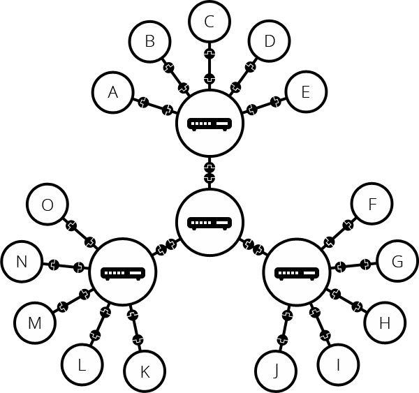

# 인터넷 작동원리

> 인터넷이란?
>
> TCP/IP 프로토콜을 기반으로 하여 전 세계 수많은 컴퓨터와 네트워크들이 연결된 광범위한 컴퓨터 통신망.

## 단순한 네트워크

두 개의 컴퓨터가 통신이 필요할 때, 우리는 다른 컴퓨터와 물리적으로(전선) 또는 무선으로 연결되어야 한다. 

이러한 네트워크는 두 대가 아닌 원하는 만큼의 컴퓨터를 연결할 수 있다. 하지만 많이 연결할 수록 복잡해진다. 예를 들어 10대의 컴퓨터를 연결하려는 경우 컴퓨터당 9개의 클러그가 달린 45개의 케이블이 필요하다.

이 문제를 해결하기 위해 네트워크의 각 컴퓨터는 라우터라고 하는 특수한 소형 컴퓨터에 연결된다. 이 라우터는 단 하나의 작업만 수행한다. 철도역의 신호원처럼 주어진 컴퓨터에서 보낸 메세지가 올바른 대상 컴퓨터에 도착하는지 확인한다.컴퓨터 B에게 메시지를 보내려면 컴퓨터 A가 메시지를 라우터로 보내야하며, 라우터는 메시지를 컴퓨터 B로 전달하고 메시지가 컴퓨터 C로 배달되지 않도록 해야한다.

이 라우터를 시스템에 추가하면 10대의 컴퓨터 네트워크에는 10개의 케이블만 필요합니다. 각 컴퓨터마다 단일 플러그와 10개의 플러그가 있는 하나의 라우터가 필요합니다.

## 네트워크 속의 네트워크

만약 수백, 수천, 수십억 대의 컴퓨터를 연결하는 경우는 어떨까? 물론 단일 라우터는 그 정도까지 확장 할 수 없지만, 라우터 또한 컴퓨터이므로 라우터끼리 연결할 수 있다.

컴퓨터를 라우터에 연결하고, 라우터에서 라우터로 무한히 확장할 수 있다.

이러한 네트워크는 우리가 **인터넷**이라고 부르는 것에 매우 가깝지만, 우리는 뭔가를 놓치고 있다. 우리는 아주 먼 곳의 네트워크와 통신을 하고 싶을 수 있다. 하지만 아주 먼 곳에 케이블을 연결할 수 없다. 이 문제를 해결하기 위해 전화 시설을 사용할 수 있다. 전화 시설은 이미 세계 어느 곳과도 연결되어 있으므로 네트워크를 전화 시설에 연결한다면 통신이 가능할 것이다. 이를 위해 **모뎀**이라는 장비가 필요하다. 모뎀은 우리 네트워크의 정보를 전화 시설에서 처리 할 수 있는 정보로 바꾸며, 그 반대의 경우도 수행한다.

그래서 우리의 네트워크는 전화 시설에 연결된다. 다음 단계는 우리의 네트워크에서 도달하려는 네트워크로 메시지를 보내는 것이다. 그렇게하기 위해 네트워크를 **인터넷 서비스 제공 업체**(Internet Service Provider, ISP)에 연결한다. ISP는 모두 함께 연결되는 몇몇 특수한 라우터를 관리하고 다른 ISP의 라우터에도 액세스 할 수 있는 회사이다. 따라서 우리 네트워크의 메시지는 ISP 네트워크의 네트워크를 통해 대상 네트워크로 전달된다. 인터넷은 이러한 전체 네트워크 인프라로 구성된다.

*참고 : 우리나라의 ISP는 대표적으로 KT, SK브로드밴드, LG 유플러스 등이 있다.*

## 컴퓨터 찾기

컴퓨터에 메시지를 보내려면 메시지를 받을 특정 컴퓨터를 지정해야 한다. 따라서 네트워크에 연결된 모든 컴퓨터에는 IP(인터넷 프로토콜) 주소라는 고유한 주소가 있다. 주소는 점으로 구분 된 네 개의 숫자로 구성된 주소이다. 예 :`192.168.2.10`

컴퓨터는 이러한 주소로 다른 컴퓨터를 찾아가는데 문제가 없다. 하지만 우리들은 IP주소를 기억하기 어렵다. 그래서 우리는 '도메인 이름'이라고하는 사람이 읽을 수 있는 IP 주소의 이름을 지정할 수 있다. 예를 들어 `google.com`은 IP 주소로 `173.194.121.32`이다.

## 인터넷과 웹

웹 브라우저를 사용하여 웹을 탐색 할 때 일반적으로 도메인 이름을 사용하여 웹 사이트에 접속한다. 그것은 인터넷과 웹이 같은 것을 의미할까? 인터넷은 수십억 대의 컴퓨터를 모두 연결하는 기술 인프라이다. 이 중 일부는 '웹 서버'로서 웹 브라우저가 이해할 수 있는 서비스를 제공한다. 인터넷은 인프라이며, 웹은 그 인프라 기반 위에 구축된 서비스이다. 