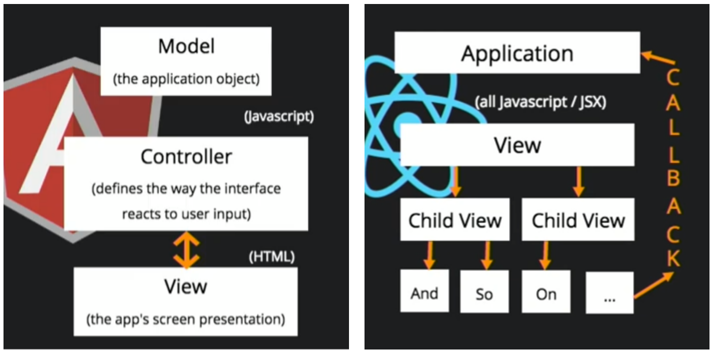

# React.js란?

> React.js 시작 전 개념부터 알아보자

## React.js란

프레임워크가 아닌 라이브러리

- **프레임워크** : 애플리케이션 구축 시 모든 애플리케이션의 공통적인 부분을 제공해준다. 필요한 기능이 이미 만들어져 있어서 만들어진 '틀' 안에 '내용물'을 채워넣음으로써 완성시킨다. 미리 만들어진 틀 밖으로 벗어나기가 어렵다.
- **라이브러리** : 필요한 부분만을 단독으로 가지고 와서 사용하는 것이 가능하다. 기능을 하게 하는 부품에 해당. 가볍다. 

React.js는 동적인 UI를 만들기 위한 Javascript라이브러리 이다.

## React의 특징

React는 크게 다음과 같은 특징을 가진다.

1. 단방향 Data Flow
2. Component 기반 구조
3. Virtual DOM
4. Props and State
5. 선언형 언어로서 JSX를 사용한다.

### 1. 단방향 Data Flow

React는 데이터의 흐름이 한 방향으로만 흐르는 단방향 데이터 흐름을 가집니다.

*Angular.js와 같은 양방향 데이터 바인딩은 시스템의 규모가 커질수록 데이터의 흐름을 추적하기가 힘들고 복잡해지는 경향이 있어, 복잡한 앱에서도 데이터 흐름에서 일어나는 변화를 보다 예측 가능할 수 있도록 단방향 흐름을 가지도록 했다고 한다.*

### 2. Component 기반 구조

**컴포넌트란**

- 독립적인 단위의 소프트웨어 모듈을 말한다.

React는 UI(View)를 여러 컴포넌트(Component)를 쪼개서 만든다.

한 페이지 내에서도 여러 각 부분을 독립된 컴포넌트로 만들고, 이 컴포넌트를 조립해 화면을 구성한다.

컴포넌트 단위로 쪼개져 있기 때문에, 전체 코드를 파악하기가 상대적으로 쉽다. 이렇게 기능 단위, UI 단위로 캡슐화시켜 코드를 관리하기 때문에 재사용성이 높다. 따라서 코드는 반복해 입력할 필요 없이, 컴포넌트만 import해 사용하면 된다는 간편함이 있으며, 애플리케이션이 복잡해지더라도 코드의 유지보수, 관리가 용이해지는 장점을 가진다.

### 3. Virtual DOM

**DOM**

DOM은 Document Object Model의 약자이다.

DOM은 html, xml, CSS 등을 트리 구조로 인식하고, 데이터를 객체로 간주하고 관리한다.

React는 이 DOM Tree 구조와 같은 구조체를 Virtual DOM으로 가지고 있다.

**Virtual DOM**

가상의 Document Object Model을 말한다.

이벤트가 발생할 때마다 Virtual DOM을 만들고, 다시 그릴 때마다 실제 DOM과 비교하고 전후 상태를 비교해, 변경이 필요한 최소한의 변경사항만 실제 DOM에 반영해, 앱의 효율성과 속도를 개선할 수 있다.