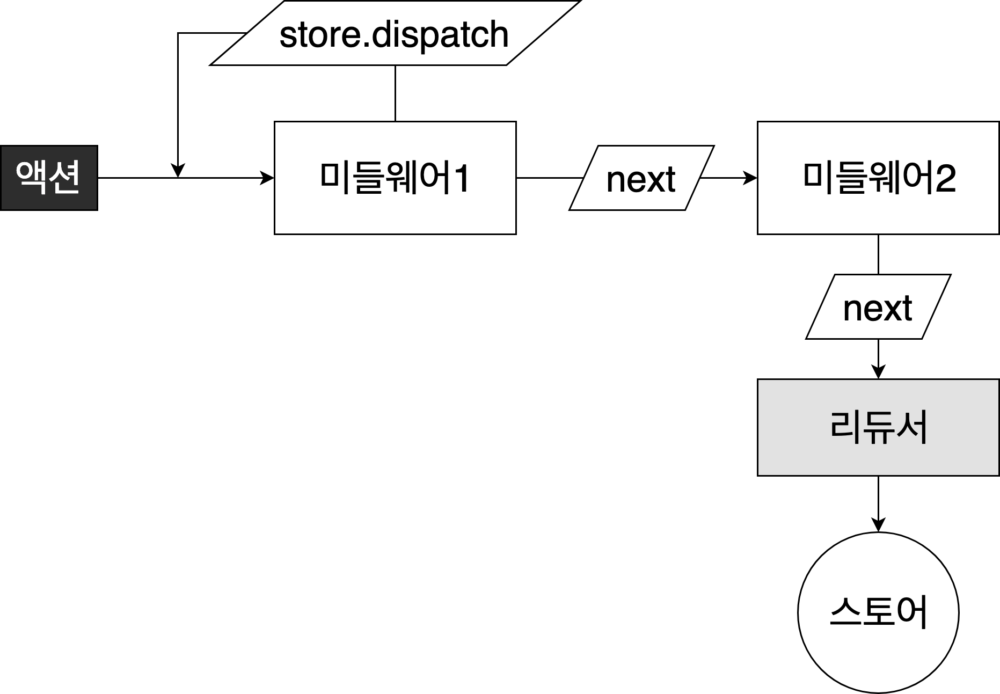

# Redux 미들웨어

리덕스 미들웨어는 리덕스가 지니고 있는 핵심 기능이다. Context API 또는 MobX를 사용하는것과 차별화가 되는 부분이다.


리덕스 미들웨어를 사용하면 액션이 디스패치 된 다음, 리듀서에서 해당 액션을 받아와서 업데이트하기 전에 추가적인 작업을 할 수 있다.

추가적인 작업이란

- 특정 조건에 따라 액션이 무시되게 만들 수 있다.
- 액션을 콘솔에 출력하거나, 서버쪽에 로깅을 할 수 있다.
- 액션이 디스패치 됐을 때 이를 수정해서 리듀서에게 전달되도록 할 수 있다.
- 특정 액션이 발생했을 때 이에 기반하여 다른 액션이 발생되도록 할 수 있다.
- 특정 액션이 발생했을 때 특정 자바스크립트 함수를 실행시킬 수 있다.

보통 리덕스에서 미들웨어를 사용하는 주된 사용 용도는 비동기 작업을 처리할 때 이다.

### 미들웨어 만들어보면서 이해하기

> 사실상 직접 미들웨어를 만들 일은 거의 없다. 하지만 직접 만들어보면서 어떤 역할인지 쉽게 이해해보자.

리덕스 미들웨어를 만들 땐 다음 템플릿을 사용한다.

```js
const middleware = store => next =>action=>{
  // 하고 싶은 작업
}
```

미들웨어는 하나의 함수이다. 함수를 연달아서 두번 리턴하는 함수. 즉, 위의 함수는 다음과 같은 의미이다.

```js
const middleware(store)=>{
  return function(next){
    return function(action){
 			// 하고 싶은 작업
    }
  }
}
```

이제 각 함수에서 받아오는 파라미터가 어떤 것을 의미하는지 알아보자.

첫번째, `store`는 리덕스 스토어 인스턴스이다. 이 안에 `dispatch`, `getState`, `subscribe` 내장함수들이 들어있다.

두번째, `next` 는 액션을 다음 미들웨어에게 전달하는 함수이다. `next(action)` 과 같은 형태로 사용한다. 만약 다음 미들웨어가 없다면 리듀서에게 액션을 전달해준다. 만약에 `next` 를 호출하지 않게 된다면 액션이 무시처리되어 리듀서에게로 전달되지 않는다.

세번째, `action` 은 현재 처리하고 있는 액션 객체이다.



미들웨어는 위와 같은 구조로 작동한다. 리덕스 스토어에는 여러개의 미들웨어를 등록할 수 있다. 새로운 액션이 디스패치 되면 첫번째로 등록한 미들웨어가 호출된다. 만약에 미들웨어에서 `next(action)` 을 호출하게 되면 다음 미들웨어로 액션이 넘어간다. 그리고 만약 미들웨어에서 `store.dispatch` 를 사용하면 다른 액션을 추가적으로 발생시킬 수도 있다.

#### 미들웨어 직접 작성해보기

**middlewares/myLogger.js**

```javascript
const myLogger = store => next => action => {
  console.log(action); // 먼저 액션을 출력해본다.
  const result = next(action); // 다음 미들웨어 (또는 리듀서) 에게 액션을 전달한다.
  return result; // 여기서 반환하는 값은 dispatch(action)의 결과물이 됩니다. 기본: undefined
};

export default myLogger;
```

단순히 전달받은 액션을 출력하고 다음으로 넘기는 작업을 구현했다.

#### 미들웨어 적용하기

#### index.js

```javascript
...
import { createStore, applyMiddleware } from 'redux';
import myLogger from './middlewares/myLogger';
...
const store = createStore(rootReducer, applyMiddleware(myLogger));

...
```

스토어에 미들웨어를 적용 할 때에는 `applyMiddleware` 라는 함수를 사용한다. 이제 카운터에서 버튼을 눌러보면 액션이 출력되는 것을 볼 수 있다.

만약 액션이 리듀서까지 전달되고 난 후의 새로운 상태를 확인하고 싶다면 다음과 같이 수정할 수 있다.

**myLogger.js**

```js
...
	// dispatch 전의 state가 0이었을 때,
	console.log(action);
  console.log("\t", store.getState()); // 0
  const result = next(action);
  console.log("\t", store.getState()); // 1
...
```