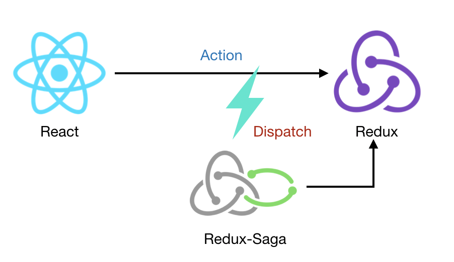

# redux-saga

> **액션**을 모니터링하고 있다가, 특정 액션이 발생하면 이에 따라 특정 작업을 하는 방식으로 사용한다.

**동작 방식**

redux-saga에서는 Genertor를 이용해 특정 액션을 모니터링하도록 하고, 해당 액션이 주어지면 이에 따라 제너레이터 함수를 실행하여 비동기 작업을 처리 후 액션을 디스패치한다.

즉, React에서 Redux 액션을 수행하면 Redux-Saga에서 디스패치하여 Redux의 액션을 가로챈다.(Proxy같이 수행한다?) 가로챈 액션을 수행한 후 다시 액션을 발생하여 다른 이벤트를 수행시킨다.

그림으로 나타내면 다음과 같다.



### Genertor 문법

함수를 특정 구간에 멈춰놓을 수도 있고, 원할 때 다시 돌아가게 할 수도 있다. 또, 결과값을 여러번 반환할 수도 있다.

제너레이터 함수를 만들 때에는 `function*` 이라는 키워드를 사용한다. 이 함수를 호출했을때는 한 객체가 반환되는데, 이를 제너레이터라고 부른다.
**제너레이터 생성**

```js
const generator = generatorFunction();
function* generatorFunction() {
    console.log('안녕하세요?');
    yield 1;
    console.log('제너레이터 함수');
    yield 2;
    console.log('function*');
    yield 3;
    return 4;
}
```

이제 `generator.next()` 를 호출하면 `yield` 한 값을 반환하고 코드의 흐름을 멈춘다.

#### Generator로 액션 모니터링하기

redux-saga는 액션을 모니터링 할 수 있다. Generator를 통해 모니터링이 어떻게 이루어지는지 알아보자.

**ex**

```js
function* watchGenerator() {
    console.log('모니터링 시작!');
    while(true) {
        const action = yield;
        if (action.type === 'HELLO') {
            console.log('안녕하세요?');
        }
        if (action.type === 'BYE') {
            console.log('안녕히가세요.');
        }
    }
}
const watch = watchGenerator();
```

- 

redux-saga에서는 이러한 원리로 액션을 모니터링하고, 특정 액션이 발생했을 때 우리가 원하는 동작을 실행시켜준다.

### 리덕스 사가 설치 및 비동기 카운터 만들기

**설치**

```
npm install --save redux-saga
```

**구현**

**modules/counter.js**

```js
...
const INCREASE_ASYNC = 'INCREASE_ASYNC';
const DECREASE_ASYNC = 'DECREASE_ASYNC';
...

export const increaseAsync = () => ({ type: INCREASE_ASYNC });
export const decreaseAsync = () => ({ type: DECREASE_ASYNC });
...
function* increaseSaga() {
  yield delay(1000); // 1초를 기다린다
  yield put(increase()); // put은 특정 액션을 디스패치 해준다.
}
function* decreaseSaga() {
  yield delay(1000); 
  yield put(decrease());
}
export function* counterSaga() {
  yield takeEvery(INCREASE_ASYNC, increaseSaga); // 모든 INCREASE_ASYNC 액션을 처리
  yield takeLatest(DECREASE_ASYNC, decreaseSaga); // 가장 마지막으로 디스패치된 DECREASE_ASYNC 액션만을 처리
}
```

put 이란 함수는 새로운 액션을 디스패치 할 수 있게한다.
takeEvery 는 특정 택션 타입에 대하여 디스패치되는 모든 액션을 처리하는 것
takeLatest는 특정 액션 타입에 대하여 디스패치된 가장 마지막 액션만을 처리한다.
따라서 increase와 decrease를 여러번 눌렀을 때, increase는 모두 실행되지만 decrease는 단 한번 실행된다.

**modules/index.js**

```js
...
import { all } from 'redux-saga/effects';
...
export function* rootSaga() {
  yield all([counterSaga()]); // all 은 배열 안의 여러 사가를 동시에 실행시켜줍니다.
}
```

여러 saga들을 합쳐서 하나의 rootSaga를 만든다. 이 때, all을 사용하여 배열안의 사가들을 동시에 실행시켜 줄 수 있도록 한다.

**index.js**

```js
...
const sagaMiddleware = createSagaMiddleware(); // 사가 미들웨어를 만든다
...
applyMiddleware(
      ReduxThunk.withExtraArgument({ history: customHistory }),
      sagaMiddleware, // 사가 미들웨어를 적용하고
      logger
    )
sagaMiddleware.run(rootSaga); // 루트 사가를 실행해준다.
// 주의: 스토어 생성이 된 다음에 위 코드를 실행해야한다.
```


**redux-saga의 주요 함수**

1. **put**
   - 특정 액션을 dispatch하도록 한다.
   - ex) `put({type: 'INCREMENT'})`
2. **call**
   - 함수의 첫 번째 파라미터는 함수, 나머지 파라미터는 해당 함수에 넣을 인수이다.
   - ex) `call(delay, 1000)` 
     ex) `call(Api.fetchUser, action.payload.userId)` : userId를 parameter로 fetchUser하는 함수를 동작시킨다.
   - *put은 인자로 들어온 action을 dispatch하는 것이고, call은 해당 함수를 실행시키는 것이다.*
3. **select**
   - redux의 state 에서 특정 상태를 가져올때 사용하는 effect이다.
   - 

takeleading

- 액션이 dispatch되고 task가 실행되면 끝날 때 까지 동일한 액션에 대해서 감지를 하지 않는다. 즉, 먼저 호출된 액션이 처리되는 것을 보장한다.