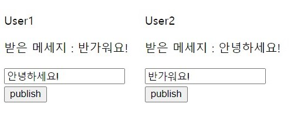

# Event Bus

#### 같은 레벨의 컴포넌트 간 통신

동일한 상위 컴포넌트를 가진 하위 컴포넌트들 간의 통신은 아래와 같이 해야 한다.

- Child(하위) => Parent(상위) => Children(하위 2개)

  **참고 : Vue에서는 컴포넌트 간의 직접적인 통신은 불가능하도록 되어있다. **

### Event Bus

​	상위 - 하위 관계가 아닌 컴포넌트 간의 통신을 위해 **Event Bus**를 활용할 수 있다.

​	Event Bus를 사용하기 위해 새로운 뷰 인스턴스를 아래와 같이 생성한다.

```js
// 화면 개발을 위한 인스턴스와 다른 별도의 인스턴스를 생성하여 활용
// 비어있는 Vue인스턴스를 선언해주고 eventBus로 사용한다.
var eventBus = new Vue();

// 화면 개발용 인스턴스
new Vue({
    // ...
})
```

이벤트를 발생시킬 컴포넌트에서 `$emit()`로 해당 event 발행

```js
eventBus.$emit("이벤트 이름",파라미터);
```

이벤트를 받을 컴포넌트에서 `$on()` 으로 해당 event를 구독

```js
// 이벤트 버스 이벤트를 일반적으로 라이프 사이클 함수에서 구독한다.
new Vue({
    created: function(){
        eventBus.$on("refresh", function(data){
            console.log(data);
        })
    }
});
```

#### **예제**

**HTML**

```html
....
      <div id="user1">
        <p>User1</p>
        <p>받은 메세지 : {{ recieveMsg }}</p>
        <input v-model="sendMsg" type="text" />
        <button @click="publishEvent">publish</button>
      </div>
    
      <div id="user2">
        <p>User2</p>
        <p>받은 메세지 : {{ recieveMsg }}</p>
        <input v-model="sendMsg" type="text" />
        <button @click="publishEvent">publish</button>
      </div>
.....
```

**EventBus**

```js
var eventBus = new Vue();
```

​	eventbus로 사용할 Vue 인스턴스를 선언한다.

**User1**

```js
var User1 = new Vue({
    el: "#user1",
    data() {
        return {
            sendMsg: "",
            recieveMsg: "",
        };
    },
    methods: {
        publishEvent() {
            eventBus.$emit("message1", this.sendMsg);
        },
        setText(text) {
            this.recieveMsg = text;
        },
    },
    created() {
        const v = this;
        eventBus.$on("message2", function (data) {
            v.setText(data);
        });
    },
});
```

**User2**

```js
var User2 = new Vue({
    el: "#user2",
    data() {
        return {
            sendMsg: "",
            recieveMsg: "",
        };
    },
    methods: {
        publishEvent() {
            eventBus.$emit("message2", this.sendMsg);
        },
        setText(text) {
            this.recieveMsg = text;
        },
    },
    created() {
        const v = this;
        eventBus.$on("message1", function (data) {
            v.setText(data);
        });
    },
});
```



​	user1과 user2에서 각각 message1, message2라는 event를 발행한다. 이를 created에서 구독을 해 두고, 해당 이벤트가 발생했을 때, 동작할 함수를 선언해 둔다. 둘은 부모자식간이 아닌 별개의 컴포넌트임에도 불구하고 서로 데이터를 주고받을 수 있다. 


**장점**

​	부모 자식간이아닌 조상, 손자 까지도 데이터 전달이 가능하며, 별개의 컴포넌트까지도 데이터 전달이 가능하다.

**단점**

​	이벤트를 구조적으로 설계하기 힘들다. 남용하면 구조가 복잡해서 알아보기 힘들다.