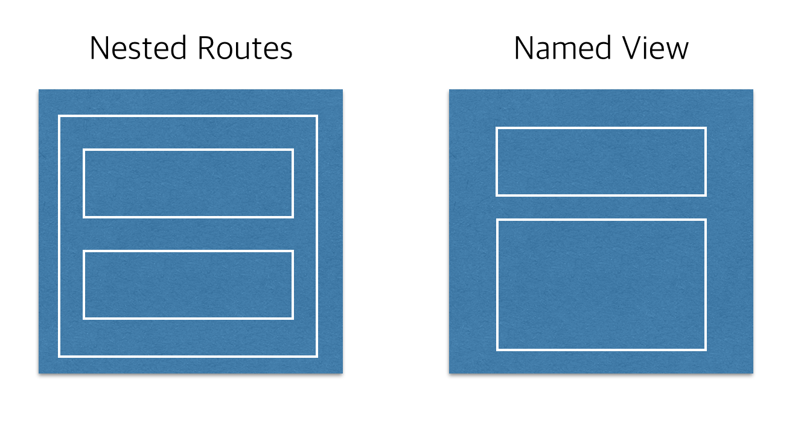

## Vue Routers

> SPA는 라우트 별로 해당하는 컴포넌트들을 미리 받아두고 라우팅이 일어나면 해당 부분을 갱신하는 방식으로 동작한다. 
>
> 뷰를 이용하여 싱글 페이지 애플리케이션을 제작할 때 유용한 [라우팅 라이브러리](https://router.vuejs.org/en/). 뷰 코어 라이브러리와 함께 공식 라이브러리로 지원되고 있다.

설치는 NPM과 CDN 방식 모두 지원한다.

```html
<script src="https://unpkg.com/vue-router/dist/vue-router.js"></script>
```

```bash
npm install vue-router --save
```

#### 라우터 생성

```js
let Foo = { template: "<div>foo</div>" };
let Bar = { template: "<div>bar</div>" };

let routes = [
    { path: "/foo", component: Foo },
    { path: "/bar", component: Bar },
];

let router = new VueRouter({
    routes,
    mode:'history',
});

let app = new Vue({
    el:"#app",
    router,
})
```

- new VueRouter인스턴스를 생성한다.
  - routes : 대상 컴포넌트와 url을 설정한다.
  - mode:'history' 
    - Vue 라우터는 기본적으로 `'루트 URL'/#/'라우터 이름'`의 구조로 되어 있다.
    - 이 옵션을 사용하면 라우터의 기본구조에서 #을 뺀다.
- Vue인스턴스의 `router`속성에 Vue 라우터 객체를 넘겨준다.

```html
<div id="app">
    <h1>Welcome To Vue Router!</h1>
    <h2>Hello {{ User }}!!</h2>
    <p>
        <router-link to="/foo">Go to Foo</router-link>
        <router-link to="/bar">Go to Bar</router-link>
    </p>
    <router-view></router-view>
</div>
```

- router-view : Router가 바뀌면 router-view 태그 위치에 해당 컴포넌트가 삽입된다.
- router-link :  태스트하기 위한 용도로 하이퍼링크로 대체된다.

#### Nested Routers

라우터로 화면을 이동할 때 네스티드 라우터를 이용하여 지정된 하위 컴포넌트를 표시할 수 있다. 이 때 컴포넌트의 구조는 가장 큰 상위의 컴포넌트가 하위의 컴포넌트를 포함하는 Parent-Child 형태와 같다.

```html
<!-- localhost:5000 -->
<div id="app">
  <router-view></router-view>
</div>

<!-- localhost:5000/home -->
<div>
  <p>Main Component rendered</p>
  <app-header></app-header>
</div>
```

```js
// 'localhost:5000/home'에 접근하면 Main과 Header 컴포넌트 둘다 표시된다.
{
  path : '/home',
  component: Main,
  children: [
    {
      path: '/',
      component: AppHeader
    },
    {
      path: '/list',
      component: List
    },
  ]
}
```

#### Named Views

특정 URL로 이동했을 때 여러 개의 컴포넌트를 동시에 표시할 수 있는 방법이다.

```html
<div id="app">
  <router-view name="appHeader"></router-view>
  <router-view></router-view>
  <router-view name="appFooter"></router-view>
</div>
```

```js
{
  path : '/home',
  // Named Router
  components: {
    appHeader: AppHeader,
    default: Body,
    appFooter: AppFooter
  }
},
```

#### Nested Router vs Named Views

- 특정 URL에 지정된 1개의 컴포넌트가 여러 개의 하위 컴포넌트를 갖는 것을 Nested Router
- 특정 URL에 여러 개의 컴포넌트를 영역 별로 지정하여 렌더링 하는 것을 Named View



#### 현재 url을 reload해야 할 때

페이지 이동시 현재 url과 같은 url을 push하면 에러가 발생한다. 이를 해결하기 위해 router.js에 해당 코드를 삽입하면 문제가 해결된다.

```js
const originalPush = VueRouter.prototype.push;
VueRouter.prototype.push = function push(location) {
  return originalPush.call(this, location).catch(() => {
    return window.location.reload();
  });
};
```

**공부필요**