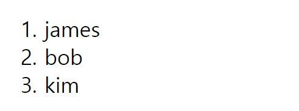

## Vue Template

> 템플릿이란 뷰로 화면을 조작하기 위해 제공되는 문법이다. 뷰 인스턴스에서 관리하는 데이터를 화면에 연결하는 데이터 바인딩과 화면의 조작을 편하게 할 수 있는 디렉티브로 나뉜다.

#### Data Binding

콧수염 문법인 “{{ }}”를 활용하여 인스턴스의 data, computed, props 속성을 연결할 수 있다. 그리고 간단한 자바스크립트 표현식도 화면에 표시할 수 있다.

```html
<div>{{ str }}</div>
<div>{{ number + 1 }}</div>
<div>{{ message.split('').reverse().join('') }}</div>
HTMLCopy
```

#### Directive

HTML 태그의 속성에 `v-` 접두사가 붙은 특별한 속성으로 화면의 DOM 조작을 쉽게할 수 있는 문법들을 제공한다.

**v-if**

v-if값이 참이면 해당 태그가 렌더링 되고 거짓이면 v-else가 렌더링된다. (v-else-if 도 가능)

```html
<!-- seen의 진위 값에 따라 p 태그가 화면에 표시 또는 미표시 -->
<p v-if="seen">Now you see me</p>

<p v-else="seen">Now you can't see me</p>
```

**v-show**

v-show값이 참이면 해당 태그가 화면에 표시된다.

```html
<p v-show="seen">Now you see me</p>
```

둘의 차이점

​	`v-if`는 조건에 따라 컴포넌트가 실제로 제거되고 생성된다. 

반면 `v-show`는 조건에 따라 단순히 css의 `display`속성만 변경된다.

**v-for**

배열의 데이터를 사용하여 여러 목록을 표시하는 데 사용할 수 있다.

```html
<ol>
    <li v-for="user in users">
    	{{ user.name }}
    </li>
</ol>
```

```js
new Vue({
    el:"#app",
    data(){
        return{
            users:[
                { name : 'james'},
                { name : 'bob'},
                { name : 'kim'},
            ]
        }
    }
})
```



**v-on**

사용자가 앱과 상호 작용할 수 있게 하는 directive. Vue 인스턴스에서 메소드를 호출하는 이벤트 리스너를 추가 할 수 있다.

`v-on:`은 `@`이라는 약어를 이용해 사용할 수 있다.

```html
<p> {{ message }} </p>
<button v-on:click = "reverseMessage">Reverse Message!!</button>
<button @click = "reverseMessage">Reverse Message!!</button>
```

**v-model**

양식에 대한 입력과 앱 상태를 양방향으로 바인드하는 directive

```html
<p> {{ message }} </p>
<input v-model="message">
```

**v-bind**

컴포넌트의 props에 데이터를 전달하기 위해 사용하는 directive

`v-bind:`는 `:`으로 사용할 수 있다.

```html
<todo-item
    v-bind:todo="item"
></todo-item>
```

```js
Vue.component('todo-item', {
  props: ['todo'],
  template: '<li>{{ todo.text }}</li>'
})
```

parent단의 컴포넌트인 todo-item의 props todo에 item값을 전달한다.

#### Filters

화면에 표시되는 텍스트의 형식을 편하게 바꿀 수 있도록 고안된 기능이며 `|` 을 이용하여 여러 개의 필터를 적용할 수 있다.

```html
<!-- message 값에 capitalize 필터를 적용하여 첫 글자를 대문자로 변경 -->
{{ message | capitalize }}
HTMLCopy
new Vue({
  filters: {
    capitalize: function(value) {
      if (!value) return "";
      value = value.toString();
      return value.charAt(0).toUpperCase() + value.slice(1);
    }
  }
});
```

