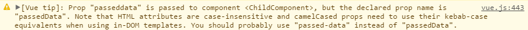

# Vue.js란 무엇인가

> Vue.js가 무엇인지 제대로 알아보자

### Vue.js란

​	MVVM 패턴의 ViewModel 레이어에 해당하는 화면단 프레임워크


- 데이터 바인딩과 화면 단위를 컴포넌트 형태로 제공하며, 관련 API를 지원하는데 궁극적인 목적이 있다.
- Angular에서 지원하는 양방향 데이터 바인딩을 동일하게 제공한다
- 컴포넌트 간 통신의 기본 골격은 React의 단방향 데이터 흐름(부모 -> 자식)을 사용
- 다른 프론트엔드 라이브러리(Angular, React)와 비교했을 때 상대적으로 가볍고 빠르다.
- 문법이 단순하고 간결하여 초기 학습 비용이 낮고 누구가 쉽게 접근 가능하다.

**MVVM패턴이란?**

[링크](./MVVM패턴.md)

### Vue.js 시작하기

```html
<!DOCTYPE html>
<html lang="en">
  <head>
    <title>Vue.js Sample</title>
    <script src="https://cdn.jsdelivr.net/npm/vue/dist/vue.js"></script>
  </head>
  <body>
    <div id="app">{{ message }}</div>
    <script>
      var app = new Vue({
        el: "#app",
        data: {
          message: "Hello Vue.js!",
        },
      });
    </script>
  </body>
</html>

```

#### Vue Instance

인스턴스는 Vue.js로 화면을 개발하기 위해 꼭 생성해야 하는 필수 단위이다.

**Vue Instance 생성자**

Vue 생성자 함수를 이용하여 인스턴스를 생성하는 방법은 아래와 같다.

```js
new Vue({
  // instance option properties
});
```

Vue 객체를 생성할 때 아래와 같이 *data, template, el, methods, life cycle hook* 등의 **인스턴스 옵션 속성**을 포함할 수 있다.

```js
new Vue({
    template: "",
    el:"",
    methods:{}
    // ...
})
```

#### Vue Instance 라이프싸이클 초기화

인스턴스가 생성될 때 아래의 초기화 작업을 수행한다.

- 데이터 관찰
- 템플릿 컴파일
- DOM 에 객체 연결
- 데이터 변경시 DOM 업데이트

이 초기화 작업 외에도 개발자가 의도하는 커스텀 로직을 아래와 같이 추가할 수 있다

```js
new Vue({
    data:{
        a: 1
    },
    created: function(){
        console.log("a is: " + this.a);
    }
})
```

위 `created` 이외에도 라이프싸이클 단계에 따라 `mounted`, `updated`, `destroyed` 등을 사용할 수 있다. 이 라이프싸이클 초기화 메서드로 커스텀 로직을 수행하기 때문에 뷰에서는 따로 Controller를 갖고 있지 않다.

### Vue Components

화면의 영역을 일정한 단위로 쪼개어 재활용 가능한 형태로 관리하는 것이 컴포넌트


컴포넌트 등록은 아래와 같은 코드로 생성 가능하다.

```html
<div id="app">
      <my-component></my-component>
</div>

...
 <script>
      var app = new Vue({
        el: "#app",
        ....
        ....
        components: {
          // '컴포넌트 이름' : 컴포넌트 내용
          "my-component": {
            template: "<div>A custom component!</div>",
          },
        },
      });
</script>
```

**Global or Local Component**

아래의 컴포넌트 등록 방식은 전역 컴포넌트 등록 방식이다.

```js
Vue.component('my-component',{
    // 컴포넌트 내용
    template:'',
    ...
})
```

아래의 방식은 지역 컴포넌트 등록 방식이다.

```js
var cmp = {
    
    template:'',
    ...
}
    
new Vue({
    components:{
    'my-cmp': cmp;
	}
})
```

### 부모와 자식 컴포넌트 관계

컴포넌트 관계도에서 상-하 관계에 있는 컴포넌트의 통신은

- 위에서 아래로는 데이터(props)를 내리고
-  아래에서 위로는 이벤트를 올린다(event emit)


#### Props

props는 상위 컴포넌트에서 하위 컴포넌트로 내리는 데이터 속성을 의미한다. 이렇게 하는 이유는 모든 컴포넌트가 각 컴포넌트 자체의 스코프를 갖고 있어 다른 컴포넌트의 값을 바로 참조할 수 없기 때문이다.

```html
!-- 상위 컴포넌트 -->
<div id="app">
  <!-- 하위 컴포넌트에 상위 컴포넌트가 갖고 있는 message를 전달함 -->
  <child-component v-bind:propsdata="message"></child-component>
</div>
```

```js
// 하위 컴포넌트
Vue.component("child-component", {
  // 상위 컴포넌트의 data 속성인 message를 propsdata라는 속성으로 넘겨받음
  props: ["propsdata"],
  template: '<p>{{ propsdata }}</p>'
});

// 상위 컴포넌트
var app = new Vue({
  el: "#app",
  data: {
    message: "Hello Vue! from Parent Component"
  }
});

```

***주의할 점: props 변수 명을 카멜 기법(aBow)으로 정의하면 html 태그에서 사용할 때는 케밥 기법(`-`)으로 선언해야 한다. 아래는 만약 프롭스 속성 명을 카멜 기법인 passedData로 선언했을 때의 주의 메시지***



```html
!-- 상위 컴포넌트 -->
<div id="app">
  // 2. html 태그안에서는 케밥 표기법으로 지정해야한다.
  <child-component v-bind:props-data="message"></child-component>
</div>
```

```js
Vue.component("child-component", {
   // 1. props 변수명을 카멜표기법으로 지정했을때,
  props: ["propsData"],
  template: '<p>{{ propsData }}</p>'
});

// 상위 컴포넌트
var app = new Vue({
  el: "#app",
  data: {
    message: "Hello Vue! from Parent Component"
  }
});
```

#### 같은 레벨의 컴포넌트 간 통신

동일한 상위 컴포넌트를 가진 하위 컴포넌트들 간의 통신은 아래와 같이 해야 한다.

- Child(하위) => Parent(상위) => Children(하위 2개)

  **참고 : Vue에서는 컴포넌트 간의 직접적인 통신은 불가능하도록 되어있다. **

#### Event Bus

​	상위 - 하위 관계가 아닌 컴포넌트 간의 통신을 위해 **Event Bus**를 활용할 수 있다.

​	Event Bus를 사용하기 위해 새로운 뷰 인스턴스를 아래와 같이 생성한다.

```js
// 화면 개발을 위한 인스턴스와 다른 별도의 인스턴스를 생성하여 활용
var eventBus = new Vue();

new Vue({
    // ...
})

이벤트를 발생시킬 컴포넌트에서 `$emit()`호출

```js
eventBus.$emit("refresh",10);
```

이벤트를 받을 컴포넌트에서 `$on()` 이벤트 수신

```js
// 이벤트 버스 이벤트를 일반적으로 라이프 사이클 함수에서 수신
new Vue({
    created: function(){
        eventBus.$on("refresh", function(data){
            console.log(data);
        })
    }
});
```


