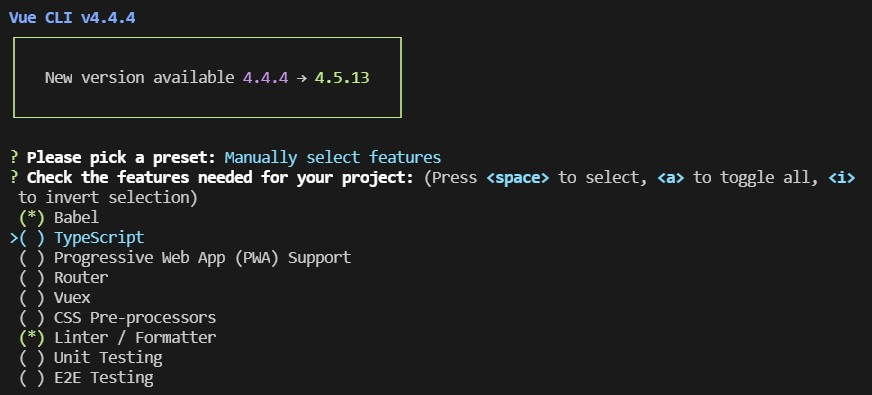
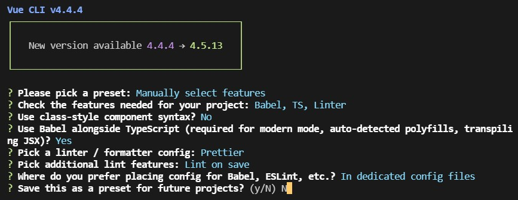
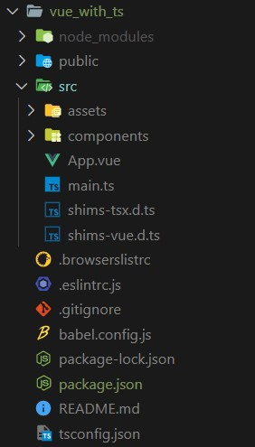

# 프로젝트 세팅

> TypeScript를 적용한 Vue를 배워보자 

vue create 명령어를 통해 프로젝트 생성을 시작한다.

TypeScript를 포함하기 위해서 Manually를 선택하고 TypeScript를 추가해준다.

나머지 옵션을 선택하고 프로젝트를 생성한다.

- **main.ts** : 생성된 프로젝트의 폴더구조를 보면 이전과 다르게 main.js가 main.ts형식으로 되어있는 것을 볼 수 있다. 하지만, main.ts의 내용은 기존과 크게 다른 점이 없는데, 타입스크립트는 기존 자바스크립트가 유효하며 필요할 때 타입스크립트를 사용하면 된다.
- **shims-vue.d.ts** : Vue 컴포넌트의 정보를 타입스크립트에 제공하는 파일이다.

