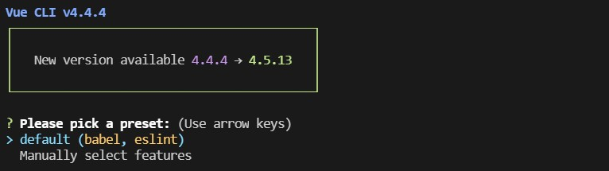
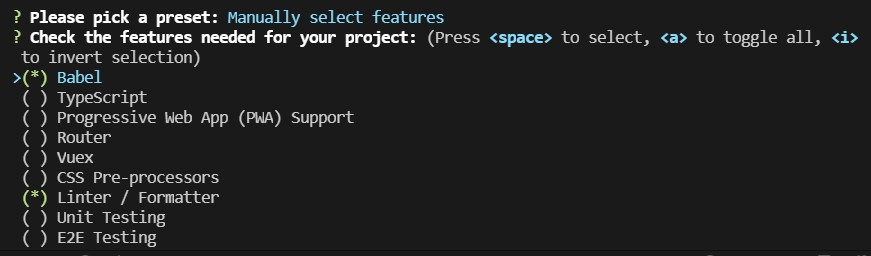
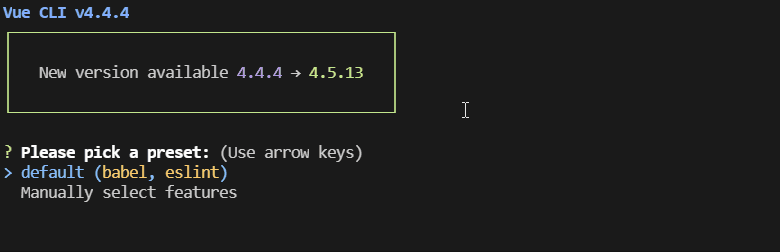
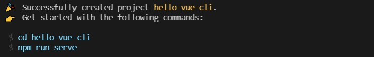
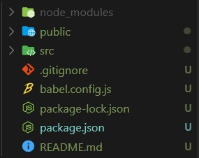
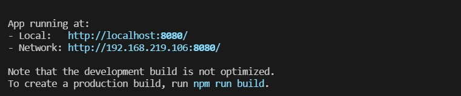
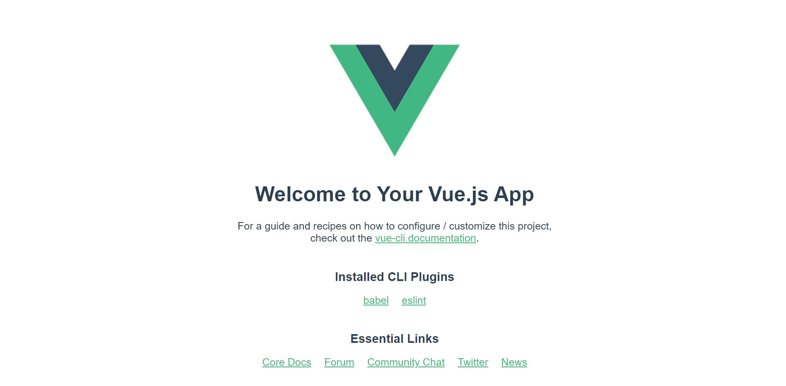
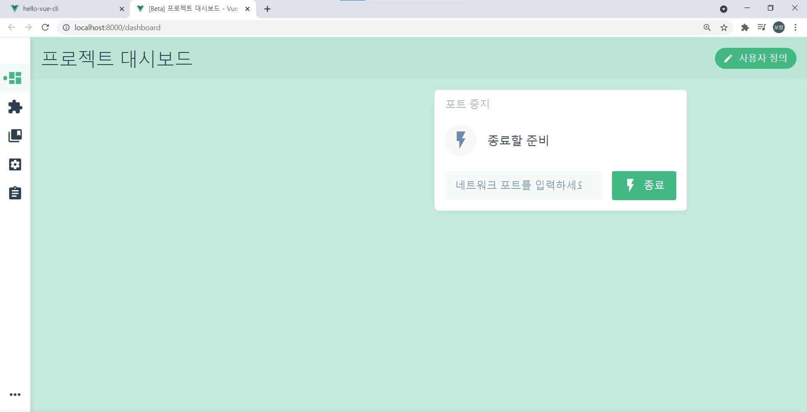

# Vue-cli

> vue-cli(Command line interface)
>
> vue project 환경을 설정해주는 도구인 vue-cli에 대해 알아보자

#### vue-cli란?

vue-cli는 기본 vue 개발 환경을 설정해주는 도구이다. vue-cli가 기본적인 프로젝트 세팅을 해주기 떄문에 폴더 구조에 대한 고민, lint, build, 어떤 라이브러리로 구성을 해야되는지 webpack 설정은 어떻게 해야되는지에 대한 고민을 덜 수 있다.

#### vue-cli로 할 수 있는 것

- **새로운 Vue 프로젝트 생성** : 몇가지 기본 골격(스케폴딩)을 선택하여 Vue 프로젝트를 빠르게 생성할 수 있다.
- **Vue 플러그인 설치/삭제** : 다양한 vue플러그인들을 추가하거나 삭제할 수 있다.
- **vue.config.js 설정** : 웹팩의 구성에 대해 `vue.config.js`로 오버라이딩하여 추가 설정할 수 있다.
- **Vue GUI 도구 사용** : cli가 낯선 개발자를 위해 GUI형태로도 도구를 제공해 준다.

####  Vue-cli설치

npm 또는 yarn 이 설치되어 있어야 한다.

```shell
npm install -g @vue/cli
# OR
yarn global add @vue/cli
```

설치 후 아래 명령어를 입력하였을 때 vue 의 version 이 나온다면 정상설치 된 것 이다.

```sh
vue --version // 3.4.0
```

vue create 프로젝트명 으로 프로젝트를 생성할 수 있다.

```sh
vue create hello-vue-cli
```

프로젝트를 생성할 때 default, Manually중 포함할 라이브러리 옵션을 선택할 수 있다.



**Manually**



**default로 프로젝트를 생성한 결과**





설치완료 후 다음과 같은 폴더 구조가 생성된다.



- node_modules : 모든 nodejs의 프로젝트가 공통으로 가지는 폴더로 실제 설치된 모듈이 저장되는 폴더이다.(손댈필요 X)
- public : 프로젝트를 배포할 때 필요한 파일들이 들어 있는 곳. (손댈필요 X)
- src : 소스 폴더를 저장하는 폴더로 이 폴더 안에다가 개발 코딩을 하는 핵심 폴더이다.
- package.json : 모든 nodejs의 프로젝트가 공통으로 가지는 설정 저장용 파일

**hello-vue-cli 폴더로 이동해 npm run serve실행한 결과**






#### Vue CLI GUI화면

```sh
vue ui
```



