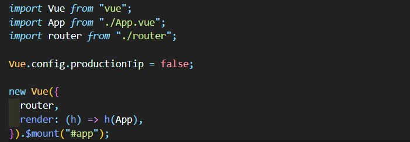
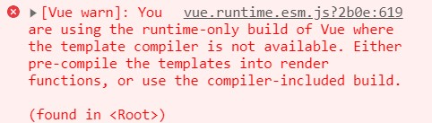

# main.js

가장 먼저 실행되는 javascript 파일이다. Vue 인스턴스를 생성하는 역할을 한다.



### render함수

Vue인스턴스 생성에서 실제로 Root Component인 `App`을 연결하고 있는 것은

```js
render(h) => h(App),
// 또는    
render: function(h){
    return h(App)
}
```

이부분이다.

이것은 단순히 `#app`의 템플릿을 지정해 주는 것이니 `template`메소드를 사용해서 다음과 같이 만들 수도 있지 않을까?

```js
new Vue({
  el: "#app",
  router,
  components: { App },
  template: `<div>
  				<app></app>
  			</div>`,
});
```

다음과 같은 에러가 발생한다.



`render`를 사용해서 pre-compile을 하거나 compiler-included build를 사용하라는 것 이다. 즉 `render`의 역할이 단순히 템플릿을 연결해주는 것이 아니라 '컴파일'도 포함되어 있다는 것이다.

*또한 공식 문서에서 소개하는 render의 필요성은 [여기](https://v3.ko.vuejs.org/guide/render-function.html#render-%E1%84%92%E1%85%A1%E1%86%B7%E1%84%89%E1%85%AE)에서 확인할 수 있다. 요약하면 `template`과 `v-if` 속성을 사용해서 중복된 코드를 작성하는 것 보다 조건에 해당하는 element를 반환할 수 있기 때문에 더욱 효율적이라는 것이다.*

이러한 코드의 이점 외에도, 앞에서 언급했듯이 render가 pre-compile을 수행하기 때문에 실제 템플릿에 더 가까운 동작을 한다는 사실이 중요하다. 이를 이해하기 위해 브라우저의 작동 방식, 즉 Node, Tree, 그리고 Virtual DOM 개념을 알아야 한다.

### Virtual DOM

Vue는 실제 DOM에 필요한 변경사항을 추적하기 위해, 기본적으로 브라우저에서 형성하는 "DOM Node" Tree 외에도 자체적으로 Virtual DOM을 만들어서 가지고 있다.

```js
return createElement('h1',this.blogTitle)
```

바로 `createElement` 명령을 통해 반환되는 객체가 Virtual DOM의 노드가 된다. 이를 VNode라고 부른다.

`render` 함수는 Vue의 실행 환경에서 `createElement` 함수를 인자로 받고, 이를 통해 만들어진 VNode를 반환하는 구조를 가진다.

즉, `main.js`에 있는

```js
render: h => h(App)
```

는 다음과 같은 뜻이다.

```js
render: (createElement) =>{
    return createElement(App)
}
```

> h라는 파라미터 이름은 JSX에서 관용적으로 쓰이는 표현이다. JSX는 Javascript + XML을 합친 기존 자바스크립트의 확장 문법이다.
>
> 이를 통해, 자바스크립트 내부에 마크업 코드를 바로 작성할 수 있다. 물론 이게 그대로 실행되는 것이 아니라, babel과 같은 transpile 도구를 통해 일반 javascript로 변환되는 것이다.
>
> `h`는 `hyperscript`의 약자로 javascript 코드를 인자로 받아 또다른 javascript 코드를 생성해 주는 것을 의미한다.


