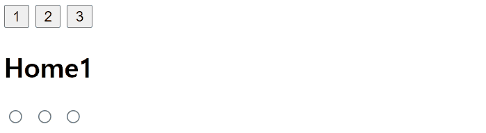
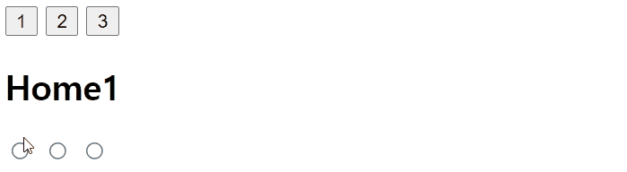

# 동적 컴포넌트

### 동적 컴포넌트

탭 인터페이스에서 컴포넌트들을 전환하기 위해서 `is`속성을 이용할 수 있다.

```html
<div id="app">
    <button @click="selectNum(1)">1</button>
    <button @click="selectNum(2)">2</button>
    <button @click="selectNum(3)">3</button>
    <component :is="selectedComponent"></component>
</div>
```

**parent**

```js
let vm = new Vue({
    el: "#app",
    data() {
        return {
            selectedComponent: "Home1",
        };
    },
    methods: {
        selectNum(num) {
            this.selectedComponent = "Home" + num;
        },
    },
});
```

**component**(Home1, Home2, ...)

```js
Vue.component("Home1", {
        template: `
          <div>
            <h2>Home1</h2>
            <input type="radio" name=1>
            <input type="radio" name=1>
            <input type="radio" name=1>
          </div>
        `,
      });
```



#### `keep-alive` 엘리먼트

하지만 이 경우 매번 컴포넌트를 재생성하기 때문에 이전에 radio버튼에 입력한 값이 초기화되는 모습을 볼 수 있다.

이를 해결하기 위해서 동적 컴포넌트를 `<keep-alive>` 태그로 둘러쌀 수 있다.

```html
<div id="app">
    <button @click="selectNum(1)">1</button>
    <button @click="selectNum(2)">2</button>
    <button @click="selectNum(3)">3</button>
    <keep-alive>
    	<component :is="selectedComponent"></component>
    </keep-alive>
</div>
```



이 경우 동적 컴포넌트 인스턴스가 처음 생성될 때 캐시 되기 때문에 이전에 입력한 값을 유지하는 것을 볼 수 있다.