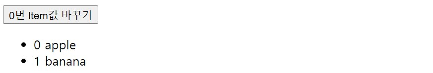
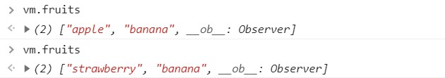

# 리스트 렌더링-1

### v-for로 엘리먼트에 배열 매핑하기

v-for 디렉티브를 사용하여 배열을 기반으로 리스트를 렌더링 할 수 있다. v-for는 `item in items`형태의 특별한 문법이 필요하다. 여기서 items는 원본 데이터 배열이고 `item`은 반복되는 배열 엘리먼트의 별칭이다.

#### 기본 사용방법

```html
<ul id="example-1">
    <li v-for="item in items">{{ item.message }}</li>
</ul>
```

```js
let example1 = new Vue({
    el: "#example-1",
    data: {
        items: [{ message: "Foo" }, { message: "Bar" }],
    },
});
```

v-for 블록 안에는 부모 범위 속성에 대한 모든 권한이 있다. 또한 v-for는 선택적 두번째 전달인자로 현재 item의 인덱스를 제공한다.

```html
 <ul id="example-1">
     <li v-for="(item, index) in items">{{ index }}. {{ item.message }}</li>
</ul>
```

#### v-for와 객체

v-for을 사용하여 객체의 속성을 반복할 수 있다.

```html
<ul id="v-for-object" class="demo">
    <li v-for="value in object">{{ value }}</li>
</ul>
```

```js
data(){
    return{
        object: {
            title: "How to do lists in Vue",
            author: "Jane Doe",
            publishedAt: "2016-04-10",
        },
    }
}
```


2개의 파라미터를 이용해 키를 사용할 수 있다

```html
<div v-for="(value, name) in object">
  {{ name }}: {{ value }}
</div>
```


3개의 파라미터를 이용하면 인덱스를 사용할 수 있다.

```html
<div v-for="(value, name, index) in object">
  {{ index }}. {{ name }}: {{ value }}
</div>
```


v-for에서는 각 항목들을 구분해주는 것이 좋다. 따라서 key를 bind해서 서로를 구분짓는 것이 좋다.(필수)

```html
<div v-for="item in items" v-bind:key="item.id">
    <!-- content -->
</div>
```

### 배열 변경 감지

#### 변이 메소드

Vue는 감시중인 배열의 변이 메소드를 래핑하여 뷰 갱신을 트리거 한다. 래핑된 메소드의 종류

*변이 메소드 : 원본 배열을 변화시키는 메소드*

- `push()`
- `pop()`
- `shift()`
- `unshift()`
- `splice()`
- `sort()`
- `reverse()`

#### 배열 대체

원본을 변형하지 않는 메소드도 있다. `filter()`,`concat()`,`slice()`이다. 이 메소드들은 원본 배열을 변형하지 않고 **항상 새 배열을 반환한다.** 

```js
example1.items = example1.items.filter(function (item) {
  return item.message.match(/Foo/)
})
```

이 과정에서 Vue는 기존 DOM을 버리고 전체 목록을 다시 렌더링하는 것이 아니라, DOM 요소 재사용을 극대화하기 위한 방법을 사용한다. [참고](https://kr.vuejs.org/v2/guide/list.html#%EB%B0%B0%EC%97%B4-%EB%8C%80%EC%B2%B4)

#### 주의사항

Vue는 배열에 대해 다음과 같은 변경 사항을 감지할 수 없다.

1. 인덱스로 배열에 있는 항목을 직접 설정하는 경우

   `vm.items[indexOfItem] = newValue`

   ```html
   <button @click="changeItem">0번 Item값 바꾸기</button>
   <ul id="example-1">
       <li v-for="(item, index) in fruits">{{ index}} {{ item }}</li>
   </ul>
   ```

   ```js
   fruits: ["apple", "banana"],
       
   ...
   methods: {
       changeItem() {
           this.fruits[0] = "strawberry";
       },
   },
   ```

   

   

   ​	console을 통해 확인한 fruits 배열의 내용은 바뀌었으나 실제 Vue에서는 적용되지 않았다(reactive하지 않다)

2. 배열 길이를 수정하는 경우

   `vm.items.length = newLength`


1번의 경우 다음과 같이 사용해야 한다.

```js
Vue.set(vm.fruits, indexOfItem, newValue)
```

```js
vm.$set(vm.fruits, indexOfItem, newValue)
```

```js
vm.fruits.splice(indexOfItem, 1, newValue)
```

2번의 경우 다음과 같이 사용해야 한다.

```js 
vm.items.splice(newLength)
```


### 객체 변경 감지에 관한 주의사항

Vue는 이미 만들어진 인스턴스에 새로운 루트레벨의 반응형 속성을 동적으로 추가하는 것을 허용하지 않는다. 

```js
let vm = new Vue({
    data() {
        return {
            obj: {
                a: 1,
            },
        };
    },
});
// `vm.obj.a` 는 반응형입니다.
vm.obj.b = 2;
// `vm.obj.b` 는 반응형이 아닙니다.
```

배열과 마찬가지로 set을 이용하여 동적으로 추가할 수 있다.

```js
Vue.set(vm.obj, 'b',2);
```

```html
vm.$set(vm.obj, 'b',2);
```

또는 `Object.assign()`을 사용해 동적으로 추가할 수 있다. 이때 단순히 원래 객체에 추가하는 것이 아니라 새로운 객체에 할당하는 방식을 이용해야 한다.

다음의 경우 반응형으로 동작하지 않는다.

```js
Object.assign(vm.userProfile, {
  age: 27,
  favoriteColor: 'Vue Green'
})
```

다음의 경우 반응형으로 동작한다.

```js
vm.userProfile = Object.assign({}, vm.userProfile, {
  age: 27,
  favoriteColor: 'Vue Green'
})
```


