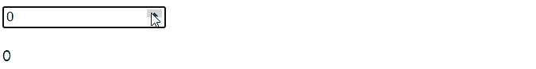
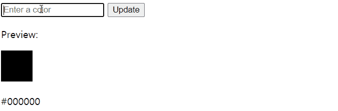

# 상태 트랜지션

> 데이터 자체에 대한 애니메이션

- 숫자와 계산
- 색 표시
- SVG노드의 위치
- 엘리먼트의 크기 및 기타 속성

이들 모두는 이미 숫자로 저장되어 있거나 숫자로 변환 될 수 있다. 그러면 Vue와 함께 라이브러리를 사용하여 상태 변경 사항을 애니메이션으로 만들 수 있다.

### Watch를 이용한 상태 애니메이션

**예제**

```html
<script src="https://cdnjs.cloudflare.com/ajax/libs/gsap/1.20.3/TweenMax.min.js"></script>
<div id="animated-number-demo">
    <input v-model.number="number" type="number" step="20" />
    <p>{{ animatedNumber }}</p>
</div>
```

```js
new Vue({
    el: "#animated-number-demo",
    data: {
        number: 0,
        tweenedNumber: 0,
    },
    computed: {
        animatedNumber() {
            return this.tweenedNumber.toFixed(0);
        },
    },
    watch: {
        number(newValue) {
            TweenLite.to(this.$data, 0.5, { tweenedNumber: newValue });
        },
    },
});
```



CSS 색상과 같이 숫자로 직접 저장되지 않은 것은 다음과 같이 구현할 수 있다.

**예제**

```html
<div id="example-7">
    <input
           v-model="colorQuery"
           v-on:keyup.enter="updateColor"
           placeholder="Enter a color"
           />
    <button v-on:click="updateColor">Update</button>
    <p>Preview:</p>
    <span
          v-bind:style="{ backgroundColor: tweenedCSSColor }"
          class="example-7-color-preview"
          ></span>
    <p>{{ tweenedCSSColor }}</p>
</div>
```

```js
var Color = net.brehaut.Color;

new Vue({
    el: "#example-7",
    data: {
        colorQuery: "",
        color: {
            red: 0,
            green: 0,
            blue: 0,
            alpha: 1,
        },
        tweenedColor: {},
    },
    created() {
        this.tweenedColor = Object.assign({}, this.color);
    },
    watch: {
        color() {
            function animate() {
                if (TWEEN.update()) {
                    requestAnimationFrame(animate);
                }
            }

            new TWEEN.Tween(this.tweenedColor).to(this.color, 750).start();

            animate();
        },
    },
    computed: {
        tweenedCSSColor() {
            return new Color({
                red: this.tweenedColor.red,
                green: this.tweenedColor.green,
                blue: this.tweenedColor.blue,
                alpha: this.tweenedColor.alpha,
            }).toCSS();
        },
    },
    methods: {
        updateColor() {
            this.color = new Color(this.colorQuery).toRGB();
            this.colorQuery = "";
        },
    },
});
```

```css
.example-7-color-preview {
    display: inline-block;
    width: 50px;
    height: 50px;
}
```

