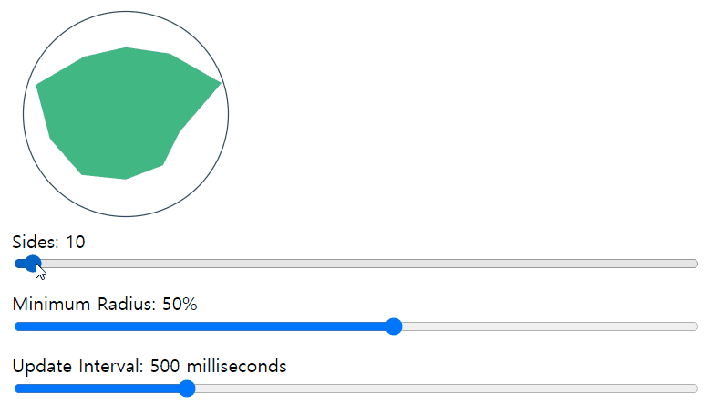

# 상태 트랜지션

> 데이터 자체에 대한 애니메이션

- 숫자와 계산
- 색 표시
- SVG노드의 위치
- 엘리먼트의 크기 및 기타 속성

이들 모두는 이미 숫자로 저장되어 있거나 숫자로 변환 될 수 있다. 그러면 Vue와 함께 라이브러리를 사용하여 상태 변경 사항을 애니메이션으로 만들 수 있다.

### Watch를 이용한 상태 애니메이션

Greensock 라이브러리를 이용한 애니메이션

**예제**

```html
<script src="https://cdnjs.cloudflare.com/ajax/libs/gsap/1.20.3/TweenMax.min.js"></script>
<div id="animated-number-demo">
    <input v-model.number="number" type="number" step="20" />
    <p>{{ animatedNumber }}</p>
</div>
```

```js
new Vue({
    el: "#animated-number-demo",
    data: {
        number: 0,
        tweenedNumber: 0,
    },
    computed: {
        animatedNumber() {
            return this.tweenedNumber.toFixed(0);
        },
    },
    watch: {
        number(newValue) {
            TweenLite.to(this.$data, 0.5, { tweenedNumber: newValue });
        },
    },
});
```


CSS 색상과 같이 숫자로 직접 저장되지 않은 것은 다음과 같이 구현할 수 있다.

**예제**

```html
<div id="example-7">
    <input
           v-model="colorQuery"
           v-on:keyup.enter="updateColor"
           placeholder="Enter a color"
           />
    <button v-on:click="updateColor">Update</button>
    <p>Preview:</p>
    <span
          v-bind:style="{ backgroundColor: tweenedCSSColor }"
          class="example-7-color-preview"
          ></span>
    <p>{{ tweenedCSSColor }}</p>
</div>
```

```js
var Color = net.brehaut.Color;

new Vue({
    el: "#example-7",
    data: {
        colorQuery: "",
        color: {
            red: 0,
            green: 0,
            blue: 0,
            alpha: 1,
        },
        tweenedColor: {},
    },
    created() {
        this.tweenedColor = Object.assign({}, this.color);
    },
    watch: {
        color() {
            function animate() {
                if (TWEEN.update()) {
                    requestAnimationFrame(animate);
                }
            }

            new TWEEN.Tween(this.tweenedColor).to(this.color, 750).start();

            animate();
        },
    },
    computed: {
        tweenedCSSColor() {
            return new Color({
                red: this.tweenedColor.red,
                green: this.tweenedColor.green,
                blue: this.tweenedColor.blue,
                alpha: this.tweenedColor.alpha,
            }).toCSS();
        },
    },
    methods: {
        updateColor() {
            this.color = new Color(this.colorQuery).toRGB();
            this.colorQuery = "";
        },
    },
});
```

```css
.example-7-color-preview {
    display: inline-block;
    width: 50px;
    height: 50px;
}
```


#### 동적 상태 트랜지션

Vue의 트랜지션 컴포넌트와 마찬가지로 데이터 백업 상태 트랜지션을 실시간으로 업데이트 할 수 있다.

```html
<script src="https://cdnjs.cloudflare.com/ajax/libs/gsap/3.7.0/gsap.min.js"></script>
<div id="app">
    <svg width="200" height="200">
        <polygon :points="points"></polygon>
        <circle cx="100" cy="100" r="90"></circle>
    </svg>
    <label>Sides: {{ sides }}</label>
    <input type="range" min="3" max="500" v-model.number="sides" />
    <label>Minimum Radius: {{ minRadius }}%</label>
    <input type="range" min="0" max="90" v-model.number="minRadius" />
    <label>Update Interval: {{ updateInterval }} milliseconds</label>
    <input type="range" min="10" max="2000" v-model.number="updateInterval" />
</div>
```

```js
new Vue({
    el: "#app",
    data() {
        let defaultSides = 10;
        let stats = Array.apply(null, { length: defaultSides }).map(() => {
            return 100;
        });
        return {
            stats: stats,
            points: generatePoints(stats),
            sides: defaultSides,
            minRadius: 50,
            interval: null,
            updateInterval: 500,
        };
    },
    watch: {
        sides(newSides, oldSides) {
            let sidesDifference = newSides - oldSides;
            if (sidesDifference > 0) {
                for (let i = 1; i <= sidesDifference; i++) {
                    this.stats.push(this.newRandomValue());
                }
            } else {
                let absoluteSidesDifference = Math.abs(sidesDifference);
                for (let i = 1; i <= absoluteSidesDifference; i++) {
                    this.stats.shift();
                }
            }
        },
        stats(newStats) {
            TweenLite.to(this.$data, this.updateInterval / 1000, {
                points: generatePoints(newStats),
            });
        },
        updateInterval() {
            this.resetInterval();
        },
    },
    mounted() {
        this.resetInterval();
    },
    methods: {
        randomizeStats() {
            let vm = this;
            this.stats = this.stats.map(function () {
                return vm.newRandomValue();
            });
        },
        newRandomValue() {
            return Math.ceil(
                this.minRadius + Math.random() * (100 - this.minRadius)
            );
        },
        resetInterval() {
            let vm = this;
            clearInterval(this.interval);
            this.randomizeStats();
            this.interval = setInterval(function () {
                vm.randomizeStats();
            }, this.updateInterval);
        },
    },
});

function valueToPoint(value, index, total) {
    let x = 0;
    let y = -value * 0.9;
    let angle = ((Math.PI * 2) / total) * index;
    let cos = Math.cos(angle);
    let sin = Math.sin(angle);
    let tx = x * cos - y * sin + 100;
    let ty = x * sin + y * cos + 100;
    return { x: tx, y: ty };
}

function generatePoints(stats) {
    let total = stats.length;
    return stats
        .map(function (stat, index) {
        let point = valueToPoint(stat, index, total);
        return point.x + "," + point.y;
    })
        .join(" ");
}
```

```css
svg {
    display: block;
}
polygon {
    fill: #41b883;
}
circle {
    fill: transparent;
    stroke: #35495e;
}
input[type="range"] {
    display: block;
    width: 100%;
    margin-bottom: 15px;
}
```




