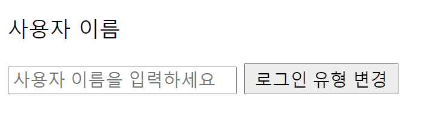
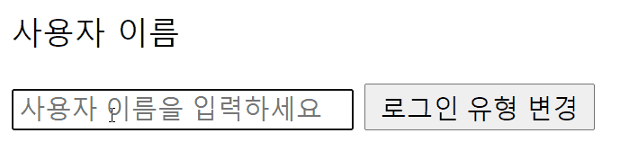

# 조건부 렌더링

### v-if

`v-if` 디렉티브는 조건에 따라 블록을 렌더링하기 위해 사용된다. 블록은 디렉티브의 표현식이 true 값을 반환할 때만 렌더링된다.

#### \<template\>에 v-if를 갖는 조건부 그룹 만들기

 `v-if`는 디렉티브기 때문에 하나의 엘리먼트에 추가해야한다. 하지만 하나 이상의 엘리먼트를 트랜지션 하려면 보이지 않는 wrapper 역할을 하는 `<template>` 엘리먼트에 v-if를 사용하면 된다. 이 경우 최종 렌더링 결과에 `<template>`엘리먼트는 포함되지 않는다.

```html
<template v-if="ok">
  <h1>Title</h1>
  <p>Paragraph 1</p>
  <p>Paragraph 2</p>
</template>
```

### `key`를 이용한 재사용 가능한 엘리먼트 제어

v-if를 이용하면 Vue를 매우 빠르게 만드는데 도움이 된다. 예를 들어 다음 예제와 같이 조건에 맞는 로그인 유형을 보여줄 수 있다.

하지만 Vue는 가능한 한 효율적으로 엘리먼트를 렌더링하려고 시도하며 가끔 처음부터 렌더링을 하지않고 재사용한다. 이 과정에서 문제가 발생할 수 있다.

```html
<template v-if="loginType === 'username'">
  <label>사용자 이름</label>
  <input placeholder="사용자 이름을 입력하세요">
</template>
<template v-else>
  <label>이메일</label>
  <input placeholder="이메일 주소를 입력하세요">
</template>
```



위와 같이 Vue는 input을 처음부터 렌더링하지 않았기 때문에 이전 입력값인 James를 그대로 유지하고있는 문제점이 발생한다.

이를 해결하기 위해 `key`속성을 사용한다

```html
<template v-if="loginType === 'username'">
  <label>사용자 이름</label>
  <input placeholder="사용자 이름을 입력하세요" key="username-input">
</template>
<template v-else>
  <label>이메일</label>
  <input placeholder="이메일 주소를 입력하세요" key="email-input">
</template>
```



label태그에는 key속성이 없기 때문에 여전히 효율적으로 재사용 한다.

### v-show

v-show는 조건과 상관없이 렌더링되어 DOM에 존재한다. 하지만 css의 display속성을 토글한다.


