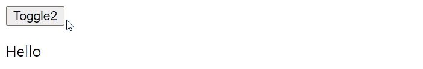

# 트랜지션

> 설명

### 단일 엘리먼트/컴포넌트 트랜지션

Vue는 `transition` 래퍼 컴포넌트를 제공하므로 다음 상황에서 모든 엘리먼트 또는 컴포넌트에 대한 진입/진출 트랜지션을 추가할 수 있다.

- 조건부 렌더링 (`v-if` 사용)
- 조건부 출력 (`v-show` 사용)
- 동적 컴포넌트
- 컴포넌트 루트 노드

**예제**

```html
<div id="app">
    <button @click="show=!show">Toggle</button>
    <transition name="fade">
        <p v-if="show">Hello</p>
    </transition>
</div>
```

```js
let vm = new Vue({
    el: "#app",
    data() {
        return {
            show: true,
        };
    },
});
```

```css
.fade-enter-active,
.fade-leave-active {
    transition: opacity 0.5s;
}
.fade-enter,
.fade-leave-to {
    opacity: 0;
}
```

`transition`컴포넌트로 싸여진 엘리먼트가 삽입되거나 제거 될 때 다음 과정이 일어난다.

1. Vue는 대상 엘리먼트에 CSS 트랜지션 또는 애니메이션이 적용되었는지 여부를 자동으로 감지한다. 적용되었다면 CSS 트랜지션 클래스가 적절한 타이밍에 추가/제거된다.
2. 트랜지션 컴포넌트가 JavaScript훅을 제공하면 이러한 훅은 적절한 타이밍에 호출된다.
3. CSS트랜지션/ 애니메이션이 감지되지 않고, JavaScript훅이 제공 되지 않으면 삽입 또는 제거를 위한 DOM 작업이 다음 프레임에서 즉시 실행된다.

####  트랜지션 클래스

enter(진입) / leave(진출) 트랜지션에는 4가지 클래스가 적용된다.

1. `v-enter` : enter의 시작 상태. 엘리먼트가 삽입되기 전에 적용되고 한 프레임 후에 제거된다.
2. `v-enter-active` : enter에 대한 활성 및 종료 상태. 엘리먼트가 삽입되기 전에 적용된다. 트랜지션 / 애니메이션이 완료되면 제거된다.
3. `v-enter-to` : enter 상태의 끝에서 실행된다. 엘리먼트가 삽입된 후(동시에 `v-enter`제거), 트랜지션 / 애니메이션이 끝나면 제거되는 프레임
4. `v-leave` : leave를 위한 시작 상태. leave 트랜지션이 트리거 될 때 적용되고 한 프레임 후에 제거된다.
5. `v-leave-active` : leave에 대한 활성 및 종료 상태. leave 트랜지션이 트리거되면 적용되고 트랜지션 / 애니메이션이 완료되면 제거된다.
6. `v-leave-to` : leave 상태의 끝에서 실행된다. leave 트랜지션이 트리거되고(동시에 `v-leave`제거), 트랜지션/애니메이션이 끝나면 제거된다.


각 클래스에는 트랜지션 이름이 접두어로 붙는다. 즉 `<transition name = "my-transition">`을 사용하면 `v-enter`는 `my-transition-enter`이다.

**예제1**


```css
.fade-enter-active,
.fade-leave-active {
    transition: opacity 0.5s;
}
.fade-enter,
.fade-leave-to {
    opacity: 0;
}
```

위의 css는 fade라는 이름의 transition에 관한 CSS이다. 

0.5초동안 opacity를 변경시키며, transition안의 엘리먼트가 나타나기 시작할 때(enter)와 사라지는 동작이 끝날 때(leave-to) opcity를 0으로 둔다.

**예제2**



```css
.slide-fade-enter-active {
    transition: all 0.3s ease;
}
.slide-fade-leave-active {
    transition: all 0.8s cubic-bezier(1, 0.5, 0.8, 1);
}
.slide-fade-enter,
.slide-fade-leave-to {
    transform: translateX(10px);
    opacity: 0;
}
```

#### CSS 애니메이션

CSS 애니메이션은 CSS트랜지션과 같은 방식으로 적용된다. 차이점은 요소가 삽입 된 직후에 `v-enter`가 제거되는 것이 아니라 `animationend`이벤트에서 제거된다는 점이다.


```css
.bounce-enter-active {
    animation: bounce-in 0.5s;
}
.bounce-leave-active {
    animation: bounce-in 0.5s reverse;
}
@keyframes bounce-in {
    0% {
        transform: scale(0);
    }
    50% {
        transform: scale(1.5);
    }
    100% {
        transform: scale(1);
    }
}
```

#### 사용자 지정 트랜지션 클래스

다음 속성을 사용하여 사용자 정의 트랜지션 **클래스**를 지정할 수 있다.

- `enter-class`
- `enter-active-class`
- `enter-to-class`
- `leave-class`
- `leave-active-class`
- `leave-to-class`

이것들은 원본 클래스 명을 오버라이드 한다. 이는 Vue의 트랜지션 시스템을 Animate.css와 같은 기존 CSS 애니메이션 라이브러리와 결합할때 유용하다.

```html
<!-- 라이브러리 -->
<link
      href="https://cdn.jsdelivr.net/npm/animate.css@3.5.1"
      rel="stylesheet"
      type="text/css"
/>
<div id="app">
    <button @click="show = !show">Toggle render</button>
    <transition
                name="custom-classes-transition"
                enter-active-class="animated tada"
                leave-active-class="animated bounceOutRight"
                >
        <p v-if="show">Hello</p>
    </transition>
</div>
```

```js
let vm = new Vue({
    el: "#app",
    data: {
        show: true,
    },
});
```


#### 명시적 트랜지션 지속 시간

대부분의 경우 Vue는 트랜지션의 완료를 자동으로 감지할 수 있다. 기본적으로 Vue는 루트 트랜지션 엘리먼트에서 첫 번째 `transitionend` 또는 `animationend` 이벤트를 기다린다. 하지만 항상 그렇지는 않다. 예를 들어, 중첩 된 내부 엘리먼트가 루트 트랜지션 엘리먼트보다 지연된 트랜지션 또는 더 긴 트랜지션 기간을 갖는 다른 엘리먼트와 함께 진행하는 트랜지션 시퀀스를 가질 수 있다.

이 경우, `<transition>`컴포넌트에 `duration`속성을 사용하여 명시적인 트랜지션 지속 시간을 지정할 수 있다.

```html
<transition :duration="1000">...</transition>
```

enter과 leave 기간에도 명시적인 값을 지정할 수 있다.

```html
<transition :duration="{enter: 500, leave: 800}">...</transition>
```

#### JavaScript 훅

속성에서 JavaScript 훅을 정의할 수 있다.

```html
<transition
  v-on:before-enter="beforeEnter"
  v-on:enter="enter"
  v-on:after-enter="afterEnter"
  v-on:enter-cancelled="enterCancelled"

  v-on:before-leave="beforeLeave"
  v-on:leave="leave"
  v-on:after-leave="afterLeave"
  v-on:leave-cancelled="leaveCancelled"
>
  <!-- ... -->
</transition>
```

```js
// ...
methods: {
  // --------
  // 진입
  // --------

  beforeEnter: function (el) {
    // ...
  },
  // done 콜백은 CSS와 함께 사용할 때 선택 사항입니다.
  enter: function (el, done) {
    // ...
    done()
  },
  afterEnter: function (el) {
    // ...
  },
  enterCancelled: function (el) {
    // ...
  },

  // --------
  // 진출
  // --------

  beforeLeave: function (el) {
    // ...
  },
  // done 콜백은 CSS와 함께 사용할 때 선택 사항입니다.
  leave: function (el, done) {
    // ...
    done()
  },
  afterLeave: function (el) {
    // ...
  },
  // leaveCancelled은 v-show와 함께 사용됩니다.
  leaveCancelled: function (el) {
    // ...
  }
}
```


**Velocity.js를 사용한 JavaScript트랜지션 예제**

```html
<div id="app">
    <button @click="show = !show">Toggle</button>
    <transition
                v-on:before-enter="beforeEnter"
                v-on:enter="enter"
                v-on:leave="leave"
                v-bind:css="false"
                >
        <p v-if="show">Demo</p>
    </transition>
</div>
```

```js
new Vue({
    el: "#app",
    data: {
        show: false,
    },
    methods: {
        beforeEnter: function (el) {
            el.style.opacity = 0;
            el.style.transformOrigin = "left center";
            console.log(el.style);
        },
        enter: function (el, done) {
            Velocity(el, { opacity: 1, fontSize: "1.4em" }, { duration: 300 });
            Velocity(el, { fontSize: "1em" }, { complete: done });
        },
        leave: function (el, done) {
            Velocity(
                el,
                { translateX: "15px", rotateZ: "50deg" },
                { duration: 600 }
            );
            Velocity(el, { rotateZ: "100deg" }, { loop: 2 });
            Velocity(
                el,
                {
                    rotateZ: "45deg",
                    translateY: "30px",
                    translateX: "30px",
                    opacity: 0,
                },
                { complete: done }
            );
        },
    },
});
```


#### 최초 렌더링 시 트랜지션

노드의 초기 렌더에 트랜지션을 적용하고 싶다면 `appear`속성을 추가 할 수 있다.

```html
<transition appear>

</transition>
```

기본적으로 enter 및 leave에 지정된 트랜지션을 사용한다. 하지만 원하는 경우 사용자 정의 CSS 클래스를 지정할수도 있다.

```html
<transition
  appear
  appear-class="custom-appear-class"
  appear-to-class="custom-appear-to-class" (2.1.8+)
  appear-active-class="custom-appear-active-class"
>
  <!-- ... -->
</transition>
```

사용자 정의 JavaScript 훅도 가능하다.

```html
<transition
  appear
  v-on:before-appear="customBeforeAppearHook"
  v-on:appear="customAppearHook"
  v-on:after-appear="customAfterAppearHook"
  v-on:appear-cancelled="customAppearCancelledHook"
>
  <!-- ... -->
</transition>
```

`appear`에 대해 `@appear="~~"`도 가능하다.

### 엘리먼트 간 트랜지션

`v-if` / `v-else`를 사용하여 원본 엘리먼트 사이를 트랜지션 할 수 있다. 이 경우 각 엘리먼트를 구분하기위해 key속성이 필요하다.

**예제**

```html
<div id="app">
    <transition name="buttons">
        <button v-if="show" @click="show=!show" key="on">on</button>
        <button v-else @click="show=!show" key="off">off</button>
    </transition>
</div>
```

```css
.buttons-enter-active,
.buttons-leave-active {
    transition: opacity 0.5s;
}
.buttons-enter,
.buttons-leave-to {
    opacity: 0;
}
```


이 경우 두 엘리먼트의 transition이 동시에 일어나 이상하게 보인다.(두 엘리먼트의 transition이 동시에 일어나야하는 경우도 있음) 이를 해결하기 위한 방법이 있다.

**mode**

- `in-out` : 진입 엘리먼트의 동작이 먼저 일어나고, 진출 엘리먼트가 실행된다.
- `out-in` : 진출 엘리먼트의 동작이 먼저 일어나고, 진입 엘리먼트가 실행된다.

**예제**

```html
<div id="app">
    <transition name="buttons" mode="in-out">
        <button v-if="show" @click="show=!show" key="on">on</button>
        <button v-else @click="show=!show" key="off">off</button>
    </transition>
</div>
```


### 컴포넌트간 트랜지션

컴포넌트 사이의 트랜지션은 `key`속성이 필요하지 않다. 


