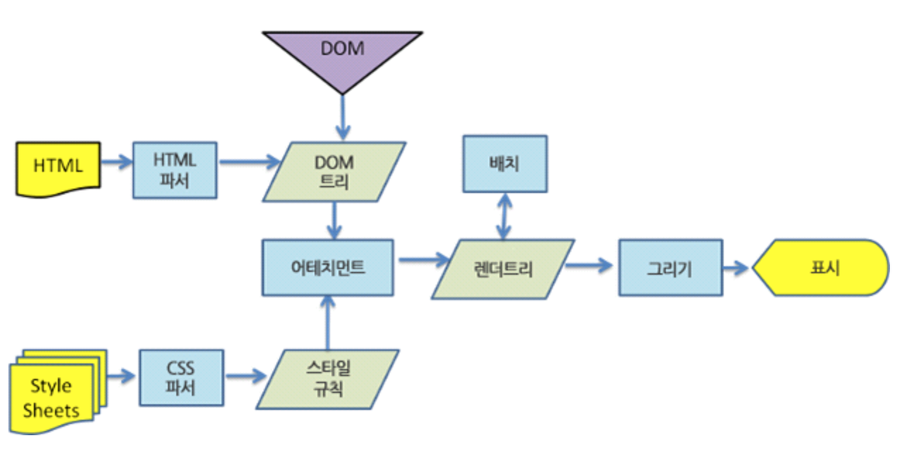

# Virtual_DOM이란 무엇인가

> Virtual DOM은 React를 통해 이미 많이 알려져있다.

**Virtual DOM**

​	Virtual DOM은 이미 React에서 사용되고 있으며, Vue.js 2.0부터 사용되고 있다. Virtual DOM 기술은 DOM 조작에 있어 비효율적인 이유에서 나오게 되었다.

DOM 조작에 있어, 비효율적인 이유를 알아보자.

 기존에는 아래와 같이, Javascript 또는 Jquery를 통해 원하는 DOM 노도를 찾은 후 변경하는 행위를 했다.

```js
document.getElementById('MyId').appendChild(myNewNode) // Javascript
$('#myId').appent(myNewNode) // jquery
```

하지만 매우 많은 노드가 존재할 수 있기 때문에, 계산하기 위해 큰 비용을 투자하게 된다.

그 결과, 성능 저하로 인한 페이지 속도 지연이 발생한다.

웹페이지를 로드하는 과정인 다음 과정을 DOM 조작을 할 때마다 영향을 끼치게 되는 것이다.



```html
<ul id='myId'>
    
    <li>item 1</li>
    <li>item 2</li>
</ul>
```

 위와 같은 HTML 코드가 있는 상태에서 id가 'myid' ul 태그 안에 li 태그 하나를 추가할 것이다.

이 작업을 위해 기존 방법으로는 javascript, jquery를 통해 노드를 찾은 후 필요한 노드를 삽입했다.

```js
let domNode ={
    tag: 'ul'
    attributes; {id:'myId'}
    children[
		// li가 들어갈 곳
	]
};
```

domNode 객체를 Virtual DOM으로 보면 된다.

직접 DOM API를 사용하지 않고, domNode 객체를 활용하게 된다.

이러한 처리는 실제 DOM이 아닌 메모리에 있기 떄문에 훨씬 더 빠르다.

```js
domNode.children.push()'<li>item 3</li>');
```

즉, 실제 DOM이 아닌 Virtual DOM에 먼저 변경 작업을 해준다.

그리고 변경된 부분만 찾아 실제 DOM에 변경해주는 방식이다.

이로써, 기존 View 방식보다 많은 양의 연산을 줄일 수 있게 된다.


Virtual DOM의 여부에 따른 차이를 보여주는 애니메이션 영상

https://www.youtube.com/watch?v=BYbgopx44vo


**참고 자료**

https://mygumi.tistory.com/190