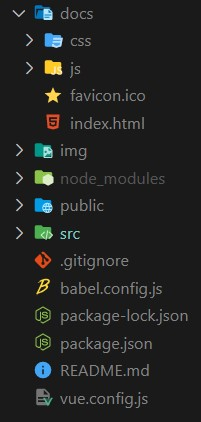
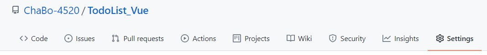
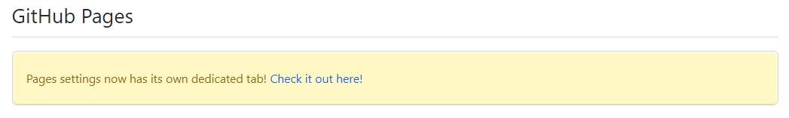
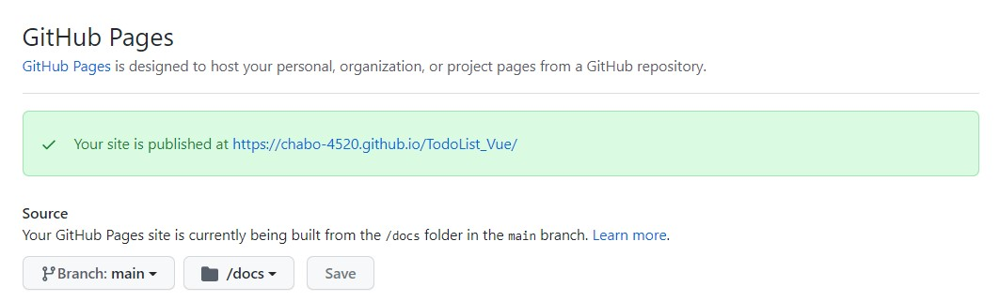
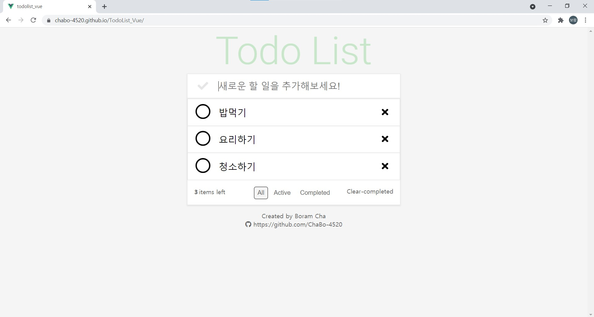

# Vue사이트 Github 배포

> 개발한 Vue를 Github에서 제공하는 기능을 통해 빠르게 배포할 수 있다.

먼저 Vue-cli를 통해 개발한 프로젝트를 Build한다.

```sh
npm run build
```

해당 명령어를 통해 프로젝트를 Build하면 프로젝트에 docs폴더가 생성되고 그 안에 프로젝트와 관련된 핵심파일들이 담기게 된다.



프로젝트를 Build한 후 vue.config.js파일을 root 디렉토리에 생성한다. 그리고 해당 파일에 다음 코드를 작성한다.[참고](https://kabkee.github.io/vue-cli/vue-cli-publicPath/)

```js
module.exports={
    publicPath: '/ProjectName/',
    outputDir: 'docs'
}
```

 이후 원격 Repository에 push한다.


원격 Repository에 이동해서 Setting으로 들어간다.



Setting에서 Github Pages를 찾아 링크를 클릭한다.



source 탭에서 Branch와 폴더를 선택해준다.



이후 배포가 완료되면 url이 주어지고 해당 url에 접속하면 배포된 웹사이트를 볼 수 있다.



